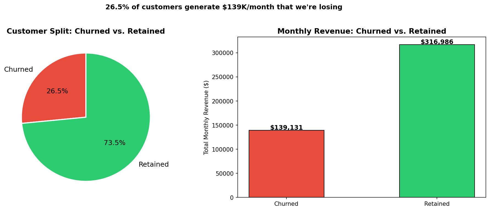
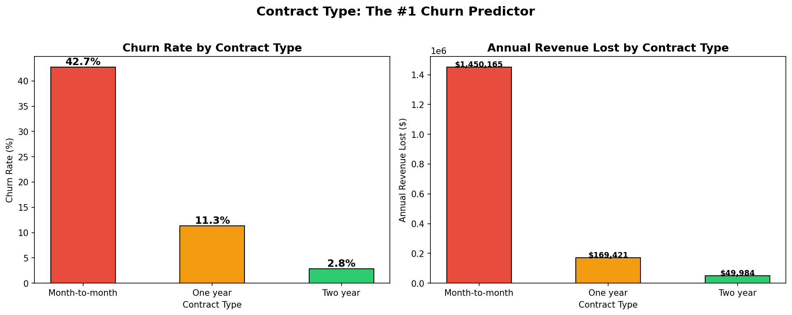
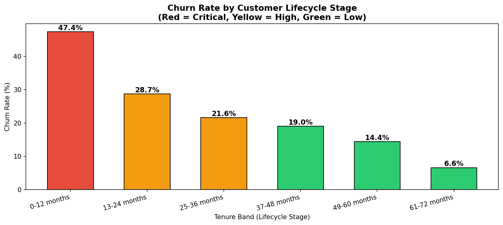
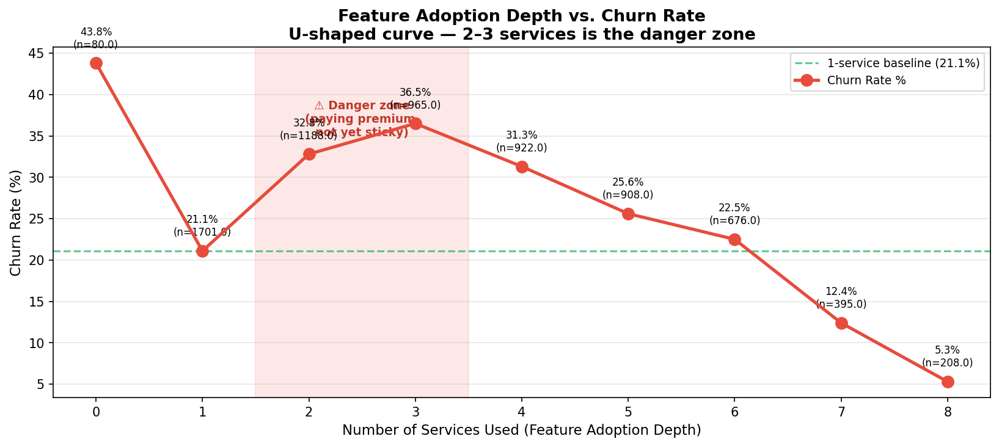
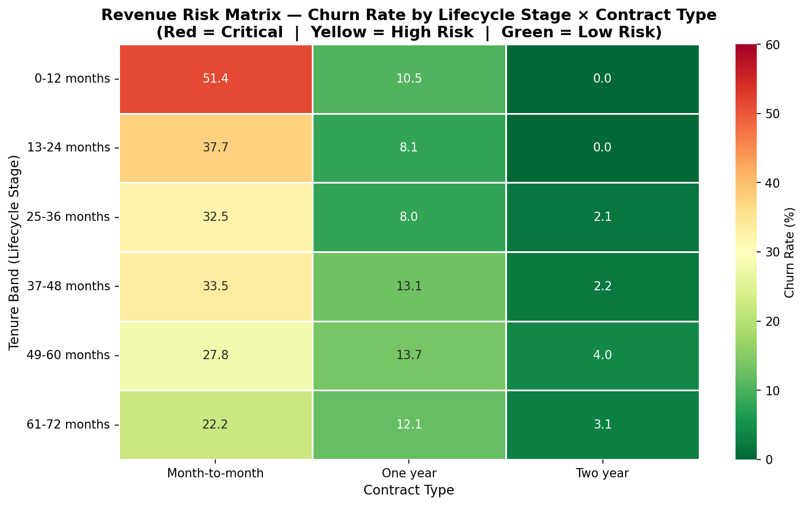
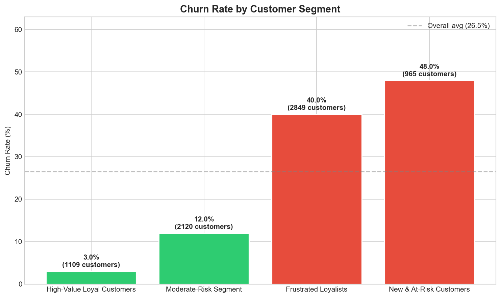
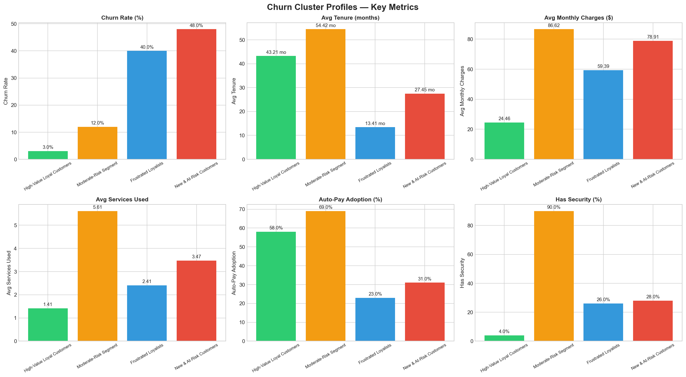
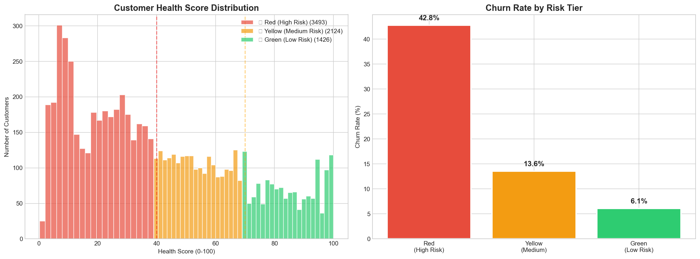
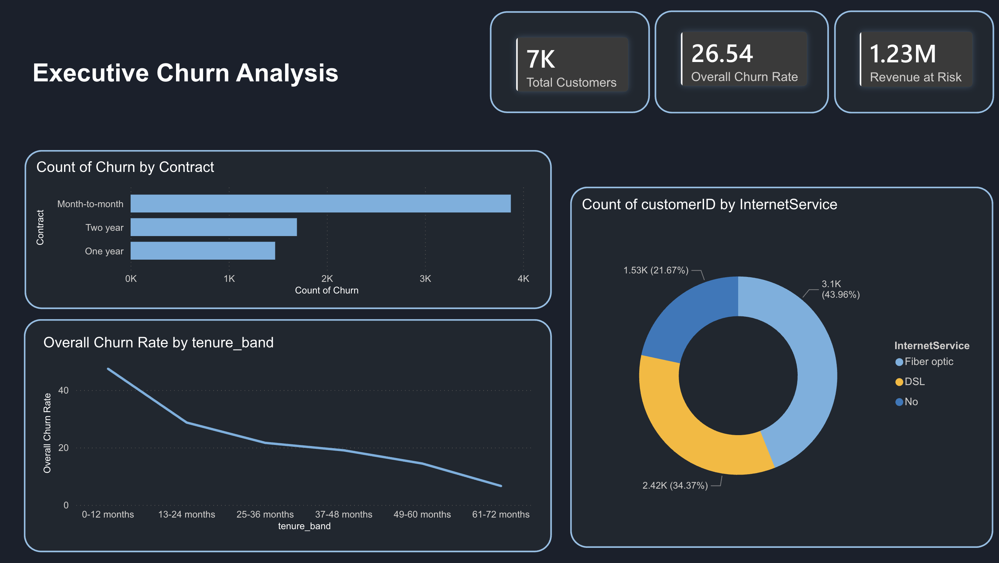

# 🩺 Subscription Churn Diagnosis & Customer Health Score

<div align="center">


**7,043 customers · 26.5% churn rate · $1.67M annual revenue loss diagnosed**

</div>

---

## 📌 The Problem

A subscription company was losing **1 in 4 customers** — but treating all at-risk customers the same. The result: CS teams wasted resources on unsaveable accounts while the highest-value retention opportunities went unaddressed.

**This project answers three questions with data:**
1. *Where* is churn concentrated? (SQL analysis — 15 queries)
2. *Which customers* share the same risk profile? (K-Means clustering)
3. *What should we do first?* (Weighted Health Score + ROI projections)

---

## 📊 The Big Picture



> 26.5% of customers (1,869) account for **$139K in monthly revenue lost** — $1.67M annualized.

---

## 🔍 Key Findings

### Finding 1 — Contract Type is the #1 Churn Predictor



Month-to-month customers churn at **42.7%** — 15× the rate of two-year customers (2.8%). This single factor drives **$1.45M of the $1.67M total annual loss**.

---

### Finding 2 — The First 12 Months are Critical



Churn drops from **47.4% in year one** to **6.6% after 5 years**. If a customer reaches month 24, they are largely retained. The intervention window is narrow.

---

### Finding 3 — More Services = Stickier Customers (But with a Danger Zone)



A U-shaped relationship: customers with **2–3 services are in the danger zone** (paying more, but not yet committed). Customers with **7+ services churn at only 5.3%** — they're fully embedded in the ecosystem.

---

### Finding 4 — Revenue Risk by Lifecycle Stage × Contract Type



The top-left cell is the crisis: **Month-to-month customers in year one churn at 51.4%**. Every other contract type across every tenure band is significantly safer. This matrix tells CS exactly where to focus.

---

## 👥 Customer Segments (K-Means Clustering, k=4)



Four behaviorally distinct archetypes emerged from K-Means clustering (silhouette score = 0.30, stable across 5 random seeds):



| Segment | Size | Churn Rate | Avg Tenure | Avg Monthly | Annual Rev Lost | Action |
|:--------|:----:|:----------:|:----------:|:-----------:|:---------------:|:-------|
| 🔴 Frustrated Loyalists | 2,849 | **39.6%** | 13.4 mo | $59.39 | **$803,223** | Win-back + contract conversion |
| 🔴 New & At-Risk Customers | 965 | **48.1%** | 27.5 mo | $78.91 | **$439,378** | Onboarding intervention + TechSupport |
| 🟡 Moderate-Risk Segment | 2,120 | 11.7% | 54.4 mo | $86.62 | $256,738 | Loyalty rewards + bundle upsell |
| 🟢 High-Value Loyal Customers | 1,109 | 2.8% | 43.2 mo | $24.46 | $9,099 | Standard management + upsell |

**What makes Frustrated Loyalists notable:** These 2,849 customers averaged 13.4 months with the company — not first-week impulse cancellations. They stayed long enough to form an opinion, then left. 100% fall in Red or Yellow risk tiers.

---

## 🏥 Customer Health Score

A weighted composite score (0–100) built from 5 behavioral signals derived from the SQL findings:

| Signal | Weight | Why |
|:-------|:------:|:----|
| Tenure | 25% | Longer customers are proven stayers |
| Contract type | 25% | Annual/2-year = committed; M2M = flight risk |
| Service depth | 20% | More services = higher switching cost |
| Payment method | 15% | Auto-pay = lower cancellation friction |
| TechSupport | 15% | Support users are measurably stickier |



**Validation — the score separates risk tiers cleanly:**

| Risk Tier | Customers | % of Base | Churn Rate | Avg Score |
|:----------|:---------:|:---------:|:----------:|:---------:|
| 🔴 Red (High Risk) | 3,493 | 49.6% | **43%** | 19.15 |
| 🟡 Yellow (Medium Risk) | 2,124 | 30.2% | 14% | 53.45 |
| 🟢 Green (Low Risk) | 1,426 | 20.2% | **6%** | 84.79 |

**7.2× churn rate separation** between Red and Green tiers — the score is predictive, not decorative.

---

## 💡 Recommendations & Projected ROI

**Tiered intervention based on Health Score:**

| Tier | Customers | Action | Investment | Projected Recovery |
|:-----|:---------:|:-------|:----------:|:------------------:|
| 🔴 Red | 3,493 | Personal CS call + annual contract incentive | $174,650 | $382,126/yr |
| 🟡 Yellow | 2,124 | Automated nurture + service upgrade offer | — | Upsell revenue |
| 🟢 Green | 1,426 | Standard management + referral incentives | — | Protect base |

**Senior TechSupport trial** (830 seniors currently without support):
- TechSupport reduces senior churn by 31 percentage points (50.6% → 19.6%)
- Estimated 257 customers retained → **$246,452/year protected**

**Combined projected recovery: ~$628,578/year against $174,650 spend = 2.2× ROI in Year 1**

---

## 📊 Power BI Dashboard



4-page interactive dashboard built in Power BI Desktop:

| Page | Purpose |
|:-----|:--------|
| **Executive Overview** | KPIs: total customers, churn rate, revenue at risk |
| **Customer Segments** | Cluster profiles with interactive slicer |
| **Health Score Distribution** | Risk tier breakdown, histogram, churn by tier |
| **Revenue Risk & ROI** | Risk matrix, intervention cost-benefit analysis |

File: `powerbi/Churn_Dashboard.pbix`

---

## 🏗️ Methodology

```
Raw Data (7,043 rows)
       │
       ▼
[Step 1] Data Cleaning & Feature Engineering
         Python / Pandas
         → Fix TotalCharges type, create tenure_band,
           services_count, has_security, churn_binary
         → Output: data/cleaned/telco_churn_final.csv
       │
       ▼
[Step 2] SQL Analysis — 15 Business Queries
         SQLite
         → Diagnose churn by contract, tenure, internet
           service, payment method, bundle depth, senior
           demographics, CLTV, and full risk matrix
         → Output: sql/churn_analysis_queries.sql
       │
       ▼
[Step 3] K-Means Clustering (k=4)
         Scikit-learn / StandardScaler
         → 5 features: tenure, MonthlyCharges,
           services_count, contract_encoded, security_encoded
         → Silhouette score: 0.30 (stable, std dev = 0.00)
         → Output: models/churn_kmeans_k4.pkl
       │
       ▼
[Step 4] Customer Health Score
         Weighted composite (5 signals)
         → Score range: 0.3 – 100.0, mean = 42.8
         → Risk tiers: Red / Yellow / Green
         → 7.2× separation between high/low risk
       │
       ▼
[Step 5] Power BI Dashboard (4 pages)
[Step 6] Executive Brief (1-page PDF)
```

---

## 📁 Project Structure

```
Project-1-Churn-Analysis/
├── README.md
├── requirement.txt
│
├── data/
│   ├── raw/                              ← Original Kaggle CSV (gitignored)
│   └── cleaned/
│       ├── telco_churn_final.csv         ← Master dataset: 21 cols, 7,043 rows
│       ├── telco_churn_cleaned.csv       ← Post-cleaning, pre-clustering
│       └── telco_churn_clustered.csv     ← With cluster assignments
│
├── notebooks/
│   ├── Churn_Analysis_Cleaning.ipynb     ← Step 1: Cleaning & feature engineering
│   ├── P1_SQL_Analysis.ipynb             ← Step 2: 15 SQL queries with outputs
│   └── Python_Clustering.ipynb          ← Steps 3–4: K-Means + Health Score
│
├── sql/
│   └── churn_analysis_queries.sql        ← All 15 queries with business comments
│
├── models/
│   ├── churn_kmeans_k4.pkl               ← Trained K-Means model
│   ├── churn_scaler.pkl                  ← StandardScaler for inference
│   └── clustering_features.json         ← Feature list for reproducibility
│
├── docs/
│   ├── Executive_Brief.pdf              ← 1-page VP-ready brief
│   ├── dashboard_overview.png           ← Power BI screenshots (4 pages)
│   ├── dashboard_clusters.png
│   ├── dashboard_health.png
│   ├── dashboard_risk.png
│   └── *.png                            ← All analysis charts
│
└── powerbi/
    └── Churn_Dashboard.pbix             ← 4-page interactive dashboard
```

---

## 🚀 How to Run

```bash
# 1. Clone this repo
git clone https://github.com/Abhisheksuwalka/subscription-churn-diagnosis.git
cd subscription-churn-diagnosis

# 2. Create and activate a virtual environment
python -m venv venv
source venv/bin/activate        # Windows: venv\Scripts\activate

# 3. Install dependencies
pip install -r requirement.txt

# 4. Launch Jupyter
jupyter notebook

# 5. Run notebooks in order:
#    Churn_Analysis_Cleaning.ipynb  →  P1_SQL_Analysis.ipynb  →  Python_Clustering.ipynb
```

> **SQL only?** The queries in `sql/churn_analysis_queries.sql` run directly against `data/cleaned/telco_churn.db` in any SQLite client (e.g., [DB Browser for SQLite](https://sqlitebrowser.org/)).

---

## 🛠️ Tech Stack

| Tool | Purpose |
|:-----|:--------|
| Python 3.9 + Pandas | Data cleaning & feature engineering |
| SQLite | 15-query business analysis |
| Scikit-learn | K-Means clustering, StandardScaler |
| Matplotlib / Seaborn | All charts and visualizations |
| Power BI Desktop | 4-page interactive dashboard |

---

## 📋 Resume Bullet

> *"Analyzed 7,043 subscription accounts using SQL & Python; identified 4 churn archetypes with K-Means clustering, revealing that Month-to-Month customers in their first year churn at 51.4% — the single largest revenue drain at $819K/year. Built a Customer Health Score (0–100) achieving 7.2× churn rate separation between risk tiers. Proposed targeted retention strategy projected to recover $628K ARR against $174K spend (2.2× ROI)."*

---

## 👤 Author

**Abhishek Suwalka** — Business Analyst Portfolio Project, May 2026

Dataset: [IBM Telco Customer Churn](https://www.kaggle.com/datasets/blastchar/telco-customer-churn) (Kaggle, 7,043 rows)
